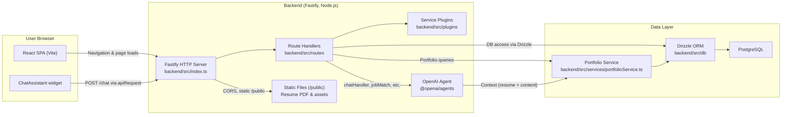

# System Architecture

This document describes the high-level architecture of the `six7swe` application, including the frontend portfolio site, backend API, data layer, and AI-powered chat assistant.

## High-Level Overview

The system is a full-stack TypeScript application consisting of:

- **Frontend**: React SPA built with Vite (in `frontend/`).
- **Backend**: Fastify HTTP API server (in `backend/`).
- **Database**: PostgreSQL accessed via Drizzle ORM.
- **AI Assistant**: Chat endpoint backed by `@openai/agents`, enriched with portfolio and resume content from the database.

The main user-facing experience is a portfolio website with:

- A landing page and sections for projects and contact information.
- A floating chat widget (`ChatAssistant`) that lets visitors converse with an AI agent configured to speak as Ray.

## Architecture Diagram

## Frontend

**Stack & location**

- **Framework**: React, TypeScript.
- **Bundler**: Vite.
- **Key files**:
  - `frontend/src/main.tsx` – bootstraps the React app.
  - `frontend/src/App.tsx` – top-level routing and layout.
  - `frontend/src/components/ChatAssistant.tsx` – floating chat widget.
  - `frontend/src/utils/api.ts` – small API client helper.

**Routing & layout**

- Uses `react-router-dom` for client-side routing.
- `App.tsx` renders:
  - `Header` with navigation/highlight state.
  - `Routes` for:
    - `/` → landing page (`Landing`), which contains portfolio sections.
    - `/work` and `/contacts` → redirects that anchor into sections on `/`.
  - `ChatAssistant` – fixed-position chat button and window rendered on all routes.

**API communication**

- `apiRequest(endpoint, options)` constructs the backend URL:
  - If `VITE_API_URL` is set, requests go to `VITE_API_URL + endpoint`.
  - Otherwise, they fall back to `/api{endpoint}` (for local proxy setups).
- `ChatAssistant` uses `apiRequest('/chat', { method: 'POST', body: JSON.stringify({ message, history }) })`.

## Backend

**Entry point**

- `backend/src/index.ts`:
  - Loads environment (`dotenv/config`).
  - Creates a Fastify instance with logging.
  - Registers:
    - **CORS** via `@fastify/cors` (open origin in dev, configurable for prod).
    - **Static file serving** via `@fastify/static` from `../public` under `/public/` (used for resume PDF and other assets).
    - **Request context** via `@fastify/request-context`, providing a per-request `user` object.
    - **Service plugins** from `backend/src/plugins`.
    - **Routes** from `backend/src/routes`.
  - Defines an `onRequest` hook that currently stubs `requestContext.user` to a fixed user (to be replaced with real auth).
  - Defines a `preHandler` hook that enforces authentication for non-public routes based on `requestContext.user`.
  - Registers a root health check route at `/` returning basic status and selected env info.
  - Listens on `PORT` (default 3000) and `HOST` (default `0.0.0.0`).

**Routing**

- `backend/src/routes/index.ts` defines HTTP routes:
  - **Public portfolio & content routes**:
    - `GET /portfolio` – returns portfolio data.
    - `GET /resume` – serves resume PDF or related content.
    - `POST /chat` – AI chat endpoint.
    - `POST /job-match` – job matching endpoint.
    - `POST /fitcheck` – role fit-check endpoint.
    - `POST /contact` – contact form handler.
    - `GET /jobs` and `GET /jobs/:source_id/:source_job_id` – job listings and detail.
  - **Protected routes** (require authenticated `user` via request context):
    - `POST /profiles/:profileId/jobs/refresh`
    - `GET /profiles/:profileId/jobs/refresh/:refreshId`
    - `GET /profiles/:profileId/jobs`
    - `GET /profiles`
    - `GET /profiles/:profileId`
    - `GET /users`
    - `GET /users/:id`

**Plugins & services**

- `backend/src/plugins/index.ts` re-exports service modules such as:
  - `jobService`, `profileService`, `profileJobService`, `refreshStatusService`, `userService`, `agentServices`, etc.
- These services encapsulate business logic and data access, keeping route handlers thin.

## Data Layer

**Database & ORM**

- **Database**: PostgreSQL (connection via `postgres` driver).
- **ORM**: Drizzle ORM.
- `backend/src/db/index.ts`:
  - Reads `DATABASE_URL` from environment and creates a `postgres` client.
  - Instantiates a Drizzle `db` client bound to the schema.
  - Re-exports:
    - The `db` instance.
    - All schema types and tables from `schema.ts`.
    - Additional API helpers from `api.ts` (if present).

**Schema**

- `backend/src/db/schema.ts` defines:
  - **Enums**:
    - `job_source` (`LINKEDIN`, `INDEED`, etc.).
    - `refresh_update_status`, `refresh_update_status_step`.
    - `match_score` (`LOW`, `MEDIUM`, `HIGH`, `TOP`).
  - **Core tables**:
    - `users` – application users.
    - `profiles` – per-user job search profiles (keywords, location, resume, etc.).
    - `jobs` – ingested job postings, with deduplication via hash and source ID.
    - `refresh_status` – status records for job refresh operations.
    - `profile_jobs` – join table tying profiles to jobs with match scores and explanations.
  - **Portfolio tables**:
    - `portfolio_profile` – single-row table for the portfolio owner (name, title, contact, skills, experience, projects, and full resume text).
    - `content_sections` – structured content sections (e.g., additional portfolio pages) loaded into the chat context and portfolio UI.
  - Strong foreign keys and indexes for integrity and query performance.

**Portfolio service & caching**

- `backend/src/services/portfolioService.ts`:
  - Reads `portfolio_profile` (id 1) and ordered `content_sections` via Drizzle.
  - Shapes the data into `PortfolioData` (profile + sections).
  - Caches results in memory with TTL:
    - `PORTFOLIO_CACHE_TTL_MS` (env) or default 10 minutes.
  - Exposes `getPortfolioData()` (read with cache) and `clearPortfolioCache()` (cache invalidation).

## AI Chat Assistant Flow

**Frontend flow**

1. User opens the chat widget and sends a message.
2. `ChatAssistant`:
   - Maintains message history (user/assistant messages with timestamps).
   - Calls `apiRequest('/chat', { method: 'POST', body: JSON.stringify({ message, history }) })`.
3. On success, it appends the assistant’s response to the conversation; on error, it shows a fallback error message.

**Backend flow**

- `POST /chat` is handled by `backend/src/routes/handlers/chatHandlers.ts`:
  - Validates the incoming `message` and enforces an input length limit from `INPUT_LIMITS.chatMessage`.
  - Builds a **context string** composed of:
    - Resume and portfolio content from `getChatContext()` (which uses `getPortfolioData()`).
    - Recent chat history (up to `MAX_HISTORY_MESSAGES`), formatted for the agent.
    - The user’s current question.
  - Instantiates an `Agent` from `@openai/agents` with instructions that:
    - Make the assistant speak as Ray in first person.
    - Restrict topics to professional background, skills, experience, etc.
    - Enforce short answers by default unless the user asks for more detail.
    - Add light snark in clearly sarcastic cases.
  - Calls `run(chatAgent, context)` and returns `{ response }` to the client.

**Chat context construction**

- `backend/src/data/chatContext.ts`:
  - Uses `getPortfolioData()` to load:
    - `profile.fullResumeText` (if available) – included as `"Resume Information:\n..."`.
    - All `content_sections` – converted into markdown-style sections (`## Title\n\ncontent`).
  - Joins these into a single string used as base context for the agent.

## Authentication & Authorization

- **Request context**:
  - `@fastify/request-context` is configured so each request has a `user` in its context.
  - Currently, `onRequest` sets a hard-coded user `{ id: 1, email: 'john@example.com' }` as a placeholder.
- **Route protection**:
  - `preHandler` hook:
    - Computes whether a route is public based on its path (`/chat`, `/job-match`, `/fitcheck`, `/contact`, `/jobs`, `/portfolio`, `/`, `/resume`, and `/public/*`).
    - For non-public routes, checks `requestContext.get('user')` against `UnauthenticatedUser`.
    - Returns `401 Unauthorized` if the user is not authenticated.
- In production, the stubbed user should be replaced with a real authentication mechanism (e.g., sessions, JWT, or reverse-proxy auth) that populates `requestContext.user`.

## Static Assets & Resume Delivery

- The backend serves static files from `backend/public` (resolved as `../public` from the compiled output) under the `/public/` URL prefix.
- The resume PDF and potentially other public assets should live there.
- The `/resume` route can either:
  - Redirect to a static file under `/public/`, or
  - Stream/serve a file based on DB-backed metadata (`resumeFilename`).

## Environment & Configuration

Key environment variables:

- **Backend**
  - `PORT` – HTTP port (default: `3000`).
  - `HOST` – bind host (default: `0.0.0.0`).
  - `DATABASE_URL` – PostgreSQL connection string (required).
  - `PORTFOLIO_CACHE_TTL_MS` – TTL for portfolio cache in milliseconds (default: `600000` / 10 minutes).
- **Frontend**
  - `VITE_API_URL` – optional absolute base URL for API calls. If omitted, frontend uses `/api` as a prefix and relies on local proxying.

## Deployment Considerations

- **Local development**
  - Run the backend Fastify server and PostgreSQL locally (or via Docker).
  - Run the frontend via Vite dev server, configured either with:
    - `VITE_API_URL` pointing at the backend URL, or
    - A dev proxy from `/api` to the backend.
- **Production**
  - Build the frontend (`frontend/dist`) and serve it via:
    - A static file host (e.g., CDN, object storage + CDN), or
    - A reverse proxy/web server along with the backend.
  - Place the Fastify backend behind a reverse proxy (e.g., Nginx) that:
    - Terminates TLS.
    - Forwards `VITE_API_URL` traffic to the Fastify server.
    - Optionally serves the frontend static assets from `frontend/dist`.
  - Provision and manage a managed PostgreSQL instance.

This document should give you enough context to navigate the codebase, understand the main components, and reason about where to make changes when extending the system.

